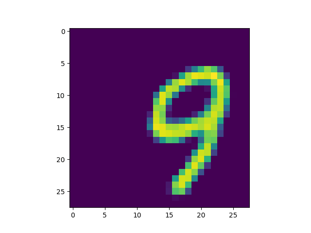

# Transformers-for-image-synthesis

Implementation of the [Taming transformers for high-resolution image synthesis
paper](https://arxiv.org/abs/2012.09841) in pytorch.

There are two components to this project. First there is the [Vector quantized
variational auto-encoder (VQVAE)](https://arxiv.org/abs/1711.00937).


# Installing the requirements

Create a virtual environment with

```bash
python3 -m venv .env
```

Then activate the environment and install the requirements:

```bash
source .env/bin/activate
pip install -r requirements.txt
```


# Training the VQVAE autoencoder

To train the VQVAE you need a `.csv` file with a column `image_path` that
contains the relative path with respect to itself to the training images. Then
simply run:

```bash
python train_vqvae.py --path_to_data path/to/your/data.csv
```

You can also play around with the hyperparameters.

When you run this script, in the same folder in the terminal, you can type
`mlflow ui`. This will open an mlflow window in your browser to track your
experiments. There you will be able to see several metrics as well as plots of
the VQVAE reconstructions side-by-side with the original images.

When you have a VQVAE with which you are satisfied with you can quantize the
whole dataset. That is, you use the encoder and the vector quantizer layer to
convert images to sequences of codebook idices. These sequences will later be
used to train the transformer model which will learn how to generate sequences
of the same distribution which can then be converted, using the decoder, to new
images.

To quantize the dataset use:

```bash
python quantize_dataset.py --model_dir <checkpoint dir> --path_to_data <path> --run_id <mlflow_id>
```

This script will quantize every image in `--path_to_data` and store the codebook
sequences under the mlflow run tagged with `--run_id`

# Training the transformer

To train the transformer you ca simply run:

```bash
python train.py --path_to_data <path_to_codebook_indices>
```

Fell free to play around with hyperparameters such as window_size. Do not forget to set the proper `latent_dim` flag.

After training a transformer you can generate new sequences with:

```bash
python transformer_generation.py --model_path --vocabulary_path --run_id
```

The model and vocabulary are saved under the proper mlflow run.

Finally you can generate the images from the codebook indices using the script
`vqvae/images_from_indexes.py` with the proper path to the `vqvae` and the
generated sequences by the transformer.

On the MNIST dataset you should get something like this:

|                          |                          |                          |
|--------------------------|--------------------------|--------------------------|
|  |  |  |
|  |  |  |
|  |  |  |

TODOS:

Proper and efficient implementation of the masking process for the transformer
sequence.
